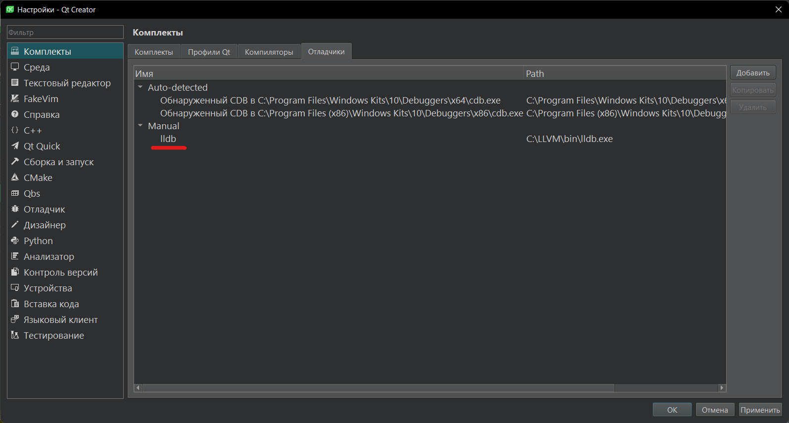
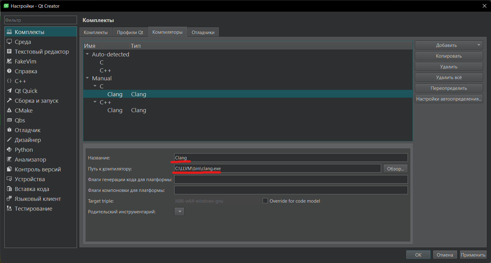
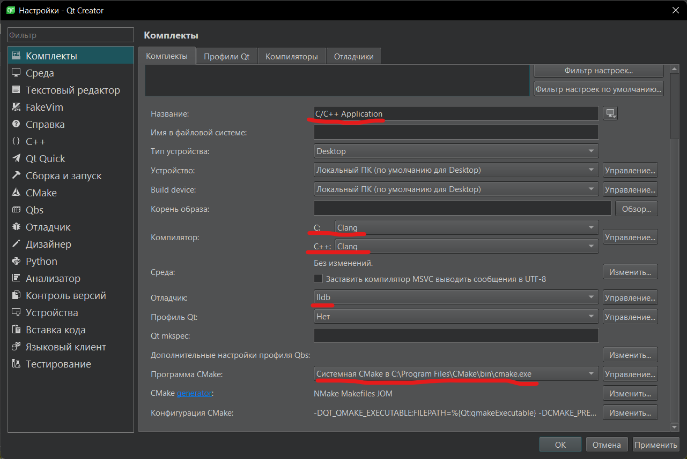

### Введение

Для выполнения лабораторных работ студенту может понадобиться компилятор языка Си и какая-нибудь IDE для более удобной разработки. 
В случае Linux и MacOS настройка среды разработки занимает минимум времени, то для Windows этот процесс более сложный и с ним часто возникают проблемы.
Ниже я постараюсь расписать процесс установки нужных инструментов, достаточных для выполнения лабораторных работ.

### Устанока компилятора

В качестве компилятора используем связку llvm+mingw. Скачать ее [здесь](https://github.com/mstorsjo/llvm-mingw/releases). 
Выбираем нужную нам версию (скорее всего подойдет llvm-mingw-20220906-ucrt-i686.zip), скачиваем и распаковываем в любое место.

### Установка CMake

Для настройки IDE нам понадобится система сборки, наиболее популярная - [CMake](https://cmake.org/download/), ее мы и установим.
Там нужно скачать файлик с названием ```cmake-3.25.0-windows-x86_64.msi```. После скачивания запускаем и следуем шагам установки. 
В конце установщик предложит прописать нужные пути в PATH, соглашаемся.

### Установка QtCreator

Скачиваем [установщик](https://www.qt.io/offline-installers) и запускаем его. 
Скорее всего необходимо будет создать аккаунт Qt, переходим по предложенной ссылке и регистрируемся.
Далее следуем по шагам установщика.

### Настройка

1. Открываем QtCreator
2. Открываем настройки: Правка -> Preferences (Да-да перевод на русский достаточной кривой)
3. Выбираем раздел комплекты. Там нам интересны три раздела: Комплекты, Компиляторы и Отладчики. Начнем с настройки отладчика
4. Во вкладке отладчики нажимаем кнопку добавить. Даем адекватное название, указываем путь до отладчика: ```<llvm+mingw>/bin/lldb.exe```



5. По такому же приниципу настраиваем вкладку Компиляторы



6. Создаем новый комплект



При создании проекта выбираем тип проекта - ```Проект без Qt```, систему сборки - ```CMake```, а комплект выбираем тот, который мы создали.

В целом установка/настройка завершена, возможно не будет работать из скоробки автодополнение и подсветка ошибок. В таком случае нужно будет прописать пути для ```clangd.exe``` и ```clang-tidy.exe``` в настройках QtCreator. Располагаются эти программы там же, где и ```clang.exe``` и ```clang++.exe```.

### Profit
